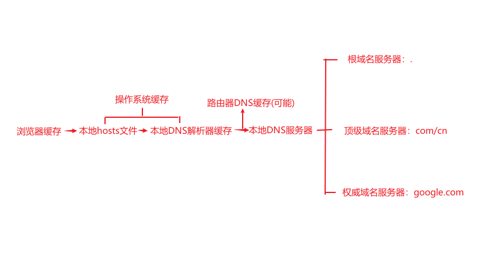
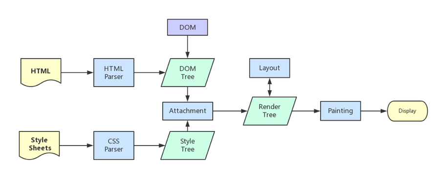

## 前言

最近在准备秋招，网上关于这道经典问题的文章特别多，看了很多大佬的文章后打算自己也总结下。

叠个甲：本篇较多内容来自网络大佬文章。但是因为文章比较多，部分知识/观点的参考网站可能没有在最后贴出，如果有大佬发现的话请联系我添加。或者不允许转载我会马上处理下的。

开始前我再谈谈我对这道面试题的想法。我个人认为这是一道好题。因为这道题覆盖的知识面很广，广的可以没有边界。比如通过层层推演一直讲到操作系统底层或者更深(在学习过程中有几位大佬就从 url 讲到了操作系统)。我的感觉是震惊+喜悦的，从知识边界往外探索的感觉很爽。但是我目前的技术能力无法全部理解(前端菜鸟)。所以本篇的整理是到我目前的知识边界的。

另外，**从这道题出发，对前端体系知识的扩展(甚至是对计算机体系知识)才是我认为应该学习的东西，由点到面**。所以本文会有大量的思考拓展，主要的形式是抛出一些问题(发现问题也是学习过程中重要的一环)，交给大家去思考。**特别建议你在评论区发表出你对一些问题/观点/知识的看法/补充/改正**。这样的碰撞也是很关键的一环。

## 思路

我将**输入 URL 到网页显示，发生了什么**的过程大体分为 3 个阶段，而每个大阶段下又分了几个关键节点：

1.浏览器发起请求阶段

- 1.1 URL 解析
- 1.2 DNS 寻址

  2.网络通信阶段

- 2.1 客户端发起 HTTP 请求
- 2.2 建立 TCP 连接（三次握手）
- 2.3 网络传输
- 2.4 服务器端处理
- 2.5 断开 TCP 连接（四次挥手）

  3.浏览器处理响应阶段

- 3.1 浏览器获取响应及预处理
- 3.2 浏览器渲染 HTML

## 浏览器发起请求

### 1.1 URL 解析

&emsp;&emsp;当用户开始在导航栏上面输入内容时，浏览器 Browser 进程的 UI 线程开始**处理输入**，UI 线程判断输入的是 URL 地址还是搜索关键字，是搜索关键字就发送给浏览器默认搜索引擎，是 URL 地址就开始 URL 解析(一般是通过协议、域名、路径等确定服务器地址)

_思考_

1.`UI线程判断输入的是URL地址还是搜索关键字`是否是即时的？目的是什么？

2.`浏览器Browser进程的UI线程`现代浏览器的基本架构？进程与线程的关系？

### 1.2 DNS 寻址

&emsp;&emsp;当用户输入完毕按下回车键的时候，UI 线程会通知网络线程初始化一个网络请求，进而**开始导航**，这时候 tab 标签页上会展示一个提示资源正在加载中的旋转圈圈，而且网络线程会进行一系列诸如 DNS 寻址以及为请求建立 TLS 连接等的操作(操作有很多，这里只是简单概括下)。

如果网络线程收到服务器的*HTTP 301 重定向响应*，它就会告知 UI 线程进行重定向然后它会再次发起一个新的网络请求。

_思考_

1.`UI线程会通知网络线程`线程间通信？(这里至少有三个问题哦!)

2.`网络线程`网络线程与网络进程？

**DNS 寻址**的主要目的是把 url 地址转为服务器 ip 地址。这其中会有一个 DNS 缓存查找过程：

如图所示

_思考_

1.初次请求和二次请求后那些地方会对 DNS 进行缓存

## 网络通信

### 2.1 客户端发起 HTTP 请求

&emsp;&emsp;客户端(浏览器)发起 HTTP 请求，构建 HTTP 报文通过**应用层**协议（如 HTTP 协议）封装

**缓存**

浏览器发送请求前，根据请求头的 expires 和 cache-control 判断是否命中（包括是否过期）**强缓存**策略，如果命中，直接从缓存获取资源，并不会发送请求。如果没有命中，则进入下一步。

没有命中强缓存规则，浏览器会发送请求，根据请求头的 If-Modified-Since 和 If-None-Match 判断是否命中**协商缓存**，如果命中，直接从缓存获取资源。如果没有命中，则进入下一步。

如果前两步都没有命中，则直接从服务端获取资源。

### 2.2 建立 TCP 连接（三次握手）

第一步：客户端发送 SYN（Synchronize）包给服务端。

- 1.客户端将序列号（Sequence Number）设为一个随机数 A，同时将标志位 SYN 置为 1，表示请求建立连接。
- 2.客户端进入 SYN_SENT 状态，并等待服务端的响应。

第二步：服务端收到 SYN 包后，回复 ACK（Acknowledgment）包和 SYN 包给客户端。

- 1.服务端将序列号设为一个随机数 B，同时将标志位 SYN 和 ACK 置为 1，表示接受客户端的请求，同时确认客户端的序列号。
- 2.服务端将确认序列号（Acknowledgment Number）设为客户端的序列号加 1。
- 3.服务端进入 SYN_RCVD 状态。

第三步：客户端收到服务端的 ACK + SYN 包后，回复一个 ACK 包给服务端。

- 1.客户端将确认序列号设为服务端的序列号加 1。
- 2.客户端将标志位 ACK 置为 1，表示对服务端的响应。
- 3.客户端进入 ESTABLISHED 状态，表示连接已经建立。

这块是面试重点区。部分的问题在四次挥手部分展示

**HTTPS**

如果是 HTTPS 协议，**在 TCP 三次握手后**，还要再进行 TLS 四次握手

大概流程：

- 1.client hello
- 2.server hello
- 3.client 验证证书，生成 secret
- 4.server 生成 secret

_思考_

1.SSL 和 TSL 的关系？

### 2.3 网络传输

&emsp;&emsp;上面一个是应用层，一个是传输层。根据网络参考模型，传输层后还有网络层(IP 数据报相关知识点)，数据链路层(祯相关知识点)，物理层(起传输作用)。

PS：等待大佬补充 0.0

_思考_

关于七层网络参考模型的相关知识点

### 2.4 服务器端处理

服务器接收并处理 HTTP 请求

服务器生成 HTTP 响应并发送回客户端（返回资源/数据）

PS：等待大佬补充 0.0

### 2.5 断开 TCP 连接（四次挥手）

&emsp;&emsp;把断开 TCP 连接放在这里说了。目前主流的 http1.1 支持长连接(Connection:keep-active),不用每次请求都进行三次握手四次挥手。

第一步：客户端发送一个 FIN（Finish）包给服务端。

- 客户端将标志位 FIN 置为 1，表示请求断开连接。
- 客户端进入 FIN_WAIT_1 状态。

第二步：服务端收到 FIN 包后，发送一个 ACK（Acknowledgment）包给客户端作为确认。

- 服务端将标志位 ACK 置为 1，确认客户端的 FIN 包。
- 服务端进入 CLOSE_WAIT 状态。
- 此时客户端进入 FIN_WAIT_2 状态，等待服务端发送自己的 FIN 包。

第三步：服务端发送一个自己的 FIN 包给客户端。

- 服务端将标志位 FIN 置为 1，表示自己也准备断开连接。
- 服务端将确认序列号设为客户端的序列号加 1。
- 服务端进入 LAST_ACK 状态。

第四步：客户端收到服务端的 FIN 包后，回复一个 ACK 包给服务端作为确认。

- 客户端将标志位 ACK 置为 1，确认服务端的 FIN 包。
- 客户端将确认序列号设为服务端的序列号加 1。
- 客户端进入 TIME_WAIT 状态，等待一段时间后关闭连接。

_思考_

1.为什么三次握手？四次挥手？(3or4?)

2.为什么不是两次握手？

3.如果已经建立连接，客户端突然出现故障怎么办？

## 浏览器处理响应

### 3.1 浏览器获取响应及预处理

&emsp;&emsp;浏览器**网络线程**接收到服务器返回的资源/数据，解析并将数据转发给**浏览器进程**。不同类型的资源根据其 MIME 类型(一般通过 HTTP 头部的 Content-Type 来确定)，被相应的引擎处理和加载执行。（响应主体是 HTML 文件，通知**渲染进程**准备进行渲染，如果是压缩文件就会交给下载管理器）

### 3.2 浏览器渲染

&emsp;&emsp;_ps:进入前端领域！_

注：GUI 渲染线程与 JS 引擎线程互斥

**GUI 渲染线程**

- HTML 解析器解析 HTML，构建**DOM 树**

  转换=》令牌化=》词法分析=》DOM 构建

- 解析 CSS，生成**CSSOM 树**

  css 解析是从右到左的

- 合并 DOM 树和 CSS 规则树，生成**render 树**

- **布局**render 树（layout/reflow），负责各元素尺寸、位置的计算

- **绘制**render 树（paint/repaint），绘制页面像素信息

- **分层、光栅化**，合成线程执行绘制操作，将图层分为图块(Tiles)，由栅格化线程将图块转化位图

- **合成、显示**，浏览器会将各层的信息发送给 GPU，GPU 会将各层合成（composite），显示在屏幕上

经典图

**JS 引擎线程**

当解析 HTML 时遇到 JS 脚本会停止 GUI 渲染线程,JS 引擎线程开始工作。

_思考_

1.`GUI渲染线程与JS引擎线程互斥`为什么？

2.这里做一个引，这部分就是 JS 的内容，从 V8 引擎开始到 JS 执行上下文，事件循环机制，垃圾回收机制。这些知识也再整理中，可以期待下。

## 站在巨人的肩上

本文很多观点/知识都来源于互联网上的前辈大佬们的文章，感谢 🍑🍑🍑

如果文中有误，还望指出。

https://zhuanlan.zhihu.com/p/102149546

https://juejin.cn/post/6844903574535667719#heading-16

https://juejin.cn/post/6935232082482298911?searchId=202308211925443A86748DAA5DDDD77716#heading-44

https://zhuanlan.zhihu.com/p/80551769
